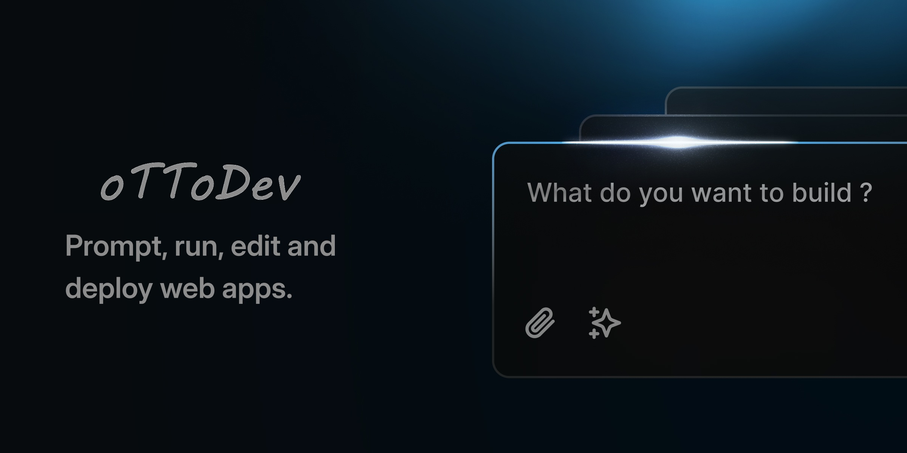

[](https://bolt.new)

# Bolt.new Fork by Cole Medin - oTToDev

## Run with Docker

Prerequisites:

Git and Node.js as mentioned above, as well as Docker: https://www.docker.com/

### 1a. Using Helper Scripts

NPM scripts are provided for convenient building:

```bash
# Development build
npm run dockerbuild

# Production build
npm run dockerbuild:prod
```

### 1b. Direct Docker Build Commands (alternative to using NPM scripts)

You can use Docker's target feature to specify the build environment instead of using NPM scripts if you wish:

```bash
# Development build
docker build . --target bolt-ai-development

# Production build
docker build . --target bolt-ai-production
```

### 2. Docker Compose with Profiles to Run the Container

Use Docker Compose profiles to manage different environments:

```bash
# Development environment
docker-compose --profile development up

# Production environment
docker-compose --profile production up
```

When you run the Docker Compose command with the development profile, any changes you
make on your machine to the code will automatically be reflected in the site running
on the container (i.e. hot reloading still applies!).